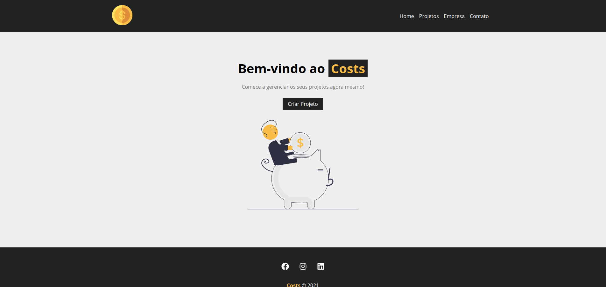

# CRUD - React JS

> Sistema de controle de projetos em React JS - Canal: `Matheus Battisti - Hora de Codar`

```
https://youtube.com/playlist?list=PLnDvRpP8BneyVA0SZ2okm-QBojomniQVO
```



> ## Índice

- [Sobre](#sobre)
- [Conteúdo do curso](#conteudo-do-curso)
- [Dependências](#dependencias)
- [Run App](#run-app)

> ## <a name="sobre"></a> Sobre

- Projeto com o objetivo de simular um sistema de controle de projetos na TI. 
- Nesse sistema é possível cadastrar, listar, editar e excluir um projeto.
- Também é possível controlar o orçamento, selecionar a categoria do projeto e adicionar serviços ao projeto.

> ## <a name="conteudo-do-curso"></a> Conteúdo do curso

- Componentização de alguns elementos
- Uso do css module como estilos
- Uso de rotas com react-router-dom
- Criação de uma API "Fake" com json-server
- Uso dos hooks useState, useEffect, useHistory
- Consumo de API sem o uso de libs terceiras para requisições

> ## <a name="dependencias"></a> Dependências
- [json-server](https://www.npmjs.com/package/json-server) - Pacote para gerar uma "fake" api para consumo no front-end 
- [react-icons](https://www.npmjs.com/package/react-icons) - Pacote de ícones para React.js
- [react-router-dom](https://www.npmjs.com/package/react-router-dom) - Possibilita a criação de rotas no projeto React.js
- [uuid](https://www.npmjs.com/package/uuid) - Pacote de criação de IDs

> ## <a name="run-app"></a> Run App

- É necessário executar os comandos de [Execução do React em ambiente de desenvolvimento](#execucao-dev) e [Execução do backend (Fake API)](#execucao-backend) ao mesmo tempo para rodar o projeto corretamente

### Clone

```
git clone https://github.com/will-cesar/react-crud-projetos.git
```

### Instalando as dependências

```
npm install
```

### <a name="execucao-dev"></a> Execução do React em ambiente de desenvolvimento

```
npm start
```

### <a name="execucao-backend"></a> Execução do backend (Fake API)

```
npm run backend
```